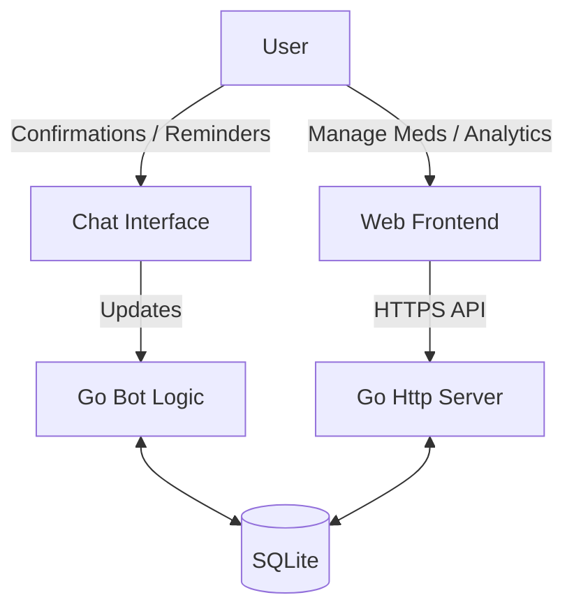

# Architecture Documentation

## System Overview

The system consists of a monolithic Go application that acts as both the Telegram Bot controller and the Web Server for the Mini App frontend.



## Security & Authentication

### Mini App (Web)
Authentication relies on `Telegram Web App Data`.
1.  The Frontend retrieves `window.Telegram.WebApp.initData` (a query string containing user info and a hash).
2.  This string is sent in the `Authorization` header (or a custom header) for every API request.
3.  The Backend validates the hash using HMAC-SHA256 and the Bot Token (Secret).
4.  The Backend extracts the `user_id` and compares it against the `ALLOWED_USER_ID` environment variable.

### Bot (Chat)
1.  On every update (message/callback), the bot checks `update.Message.From.ID`.
2.  If it does not match `ALLOWED_USER_ID`, the update is ignored or rejected.

## Database Schema (SQLite)

We use SQLite for simplicity and portability.

### `medications`
| Field | Type | Description |
|-------|------|-------------|
| `id` | INTEGER PK | Auto-increment ID |
| `name` | TEXT | Name of the medication |
| `dosage` | TEXT | e.g. "50mg" |
| `schedule_cron` | TEXT | Cron-like string or JSON definition of schedule |
| `archived` | BOOLEAN | If true, hidden from active list |
| `created_at` | DATETIME | |

### `intake_log`
| Field | Type | Description |
|-------|------|-------------|
| `id` | INTEGER PK | |
| `medication_id` | INTEGER FK | |
| `due_at` | DATETIME | When it was supposed to be taken |
| `taken_at` | DATETIME | When it was actually confirmed |
| `status` | TEXT | PENDING, TAKEN, MISSED |

## Backend Modules

### `cmd/bot`
Entry point. Loads config, initializes Database, starts Bot and Web Server.

### `internal/store`
Repository layer. Handles all SQLite queries.

### `internal/scheduler`
Responsible for checking active medications and triggering notifications at the right time.
- Runs a ticker (e.g., every minute).
- Checks if a medication is due.
- Sends a message via `internal/bot`.
- Tracks "pending confirmation" state to retry notifications.

### `internal/api`
HTTP Handlers for the Frontend.
- GET `/api/medications`: List meds.
- POST `/api/medications`: Create/Edit.
- POST `/api/log`: Confirm intake.
- GET `/api/history`: Analytics data.

## Frontend Architecture

- **Vanilla JS**: No framework overhead.
- **Telegram WebApp JS SDK**: Used for theme integration and `initData`.
- **Structure**:
    - `index.html`: Single page.
    - `style.css`: CSS Variables mapped to Telegram theme params.
    - `app.js`: Fetch logic, DOM manipulation, Event listeners.

## Blood Pressure Tracking

### Data Model

### `blood_pressure_readings`
| Field | Type | Description |
|-------|------|-------------|
| `id` | INTEGER PK | Auto-increment ID |
| `user_id` | INTEGER FK | Reference to user |
| `measured_at` | DATETIME | When the reading was taken |
| `systolic` | INTEGER | Systolic pressure (mmHg) |
| `diastolic` | INTEGER | Diastolic pressure (mmHg) |
| `pulse` | INTEGER | Heart rate (bpm) |
| `site` | TEXT | Measurement site (e.g., "left_arm") |
| `position` | TEXT | Body position (e.g., "sitting") |
| `category` | TEXT | BP category (Normal, Elevated, etc.) |
| `ignore_calc` | BOOLEAN | Skip category calculation if true |
| `notes` | TEXT | Additional notes |
| `tag` | TEXT | Custom tag for grouping |

### API Endpoints

| Method | Endpoint | Description |
|--------|----------|-------------|
| `POST` | `/api/bp` | Create a new blood pressure reading |
| `GET` | `/api/bp` | List all readings for the user |
| `DELETE` | `/api/bp/:id` | Delete a specific reading |
| `POST` | `/api/bp/import` | Import readings from CSV |
| `GET` | `/api/bp/export` | Export all readings to CSV |

### Telegram Bot Commands

| Command | Description |
|---------|-------------|
| `/bp <systolic> <diastolic> [pulse]` | Quick logging of a blood pressure reading |
| `/bphistory` | Show recent blood pressure history |
| `/bpstats` | Show blood pressure statistics |
| `/download` | Export both medication and blood pressure data to CSV (combined export) |

Example: `/bp 130 80 72` - Logs a reading with systolic 130, diastolic 80, pulse 72.

### Web Interface

The web interface includes a dedicated Blood Pressure tab with the following features:

- **Readings List**: Displays all blood pressure readings grouped by date
- **Add Reading Modal**: Form to enter new readings with fields for systolic, diastolic, pulse, site, position, and notes
- **Export CSV Button**: Download all readings in CSV format
- **Category Indicators**: Visual indicators showing the AHA category for each reading

### CSV Import

The `cmd/bpimporter/main.go` tool allows importing blood pressure readings from CSV files.

**Usage:**
```bash
go run cmd/bpimporter/main.go -csv <file> -user <id>
```

**CSV Format:**
```
Date,Systolic,Diastolic,Pulse,Site,Position,Category,Notes,Tag
```

**Example:**
```
2024-01-15 08:30,120,80,72,left_arm,sitting,Normal,Morning reading,
```

### BP Categories

Blood pressure readings are automatically categorized according to AHA (American Heart Association) guidelines:

| Category | Systolic (mmHg) | Diastolic (mmHg) |
|----------|-----------------|------------------|
| Normal | <120 | <80 |
| Elevated | 120-129 | <80 |
| High BP Stage 1 | 130-139 | 80-89 |
| High BP Stage 2 | ≥140 | ≥90 |
| Hypertensive Crisis | >180 | >120 |

**Note:** The `ignore_calc` flag can be set to `true` to skip automatic category calculation for manual overrides.
