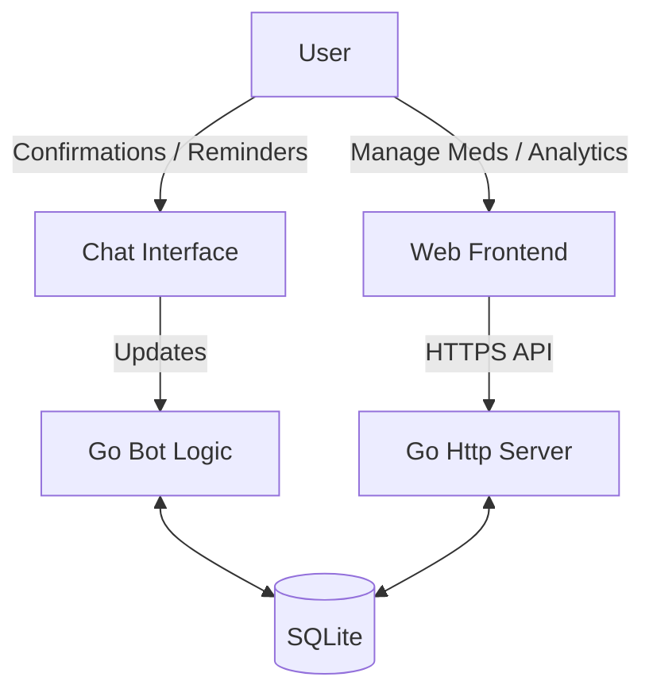

# Architecture Documentation

## System Overview

The system consists of a monolithic Go application that acts as both the Telegram Bot controller and the Web Server for the Mini App frontend.

## Security & Authentication

### Mini App (Web)
Authentication relies on `Telegram Web App Data`.
1.  The Frontend retrieves `window.Telegram.WebApp.initData` (a query string containing user info and a hash).
2.  This string is sent in the `Authorization` header (or a custom header) for every API request.
3.  The Backend validates the hash using HMAC-SHA256 and the Bot Token (Secret).
4.  The Backend extracts the `user_id` and compares it against the `ALLOWED_USER_ID` environment variable.

### Bot (Chat)
1.  On every update (message/callback), the bot checks `update.Message.From.ID`.
2.  If it does not match `ALLOWED_USER_ID`, the update is ignored or rejected.

## Database Schema (SQLite)

We use SQLite for simplicity and portability.

### `medications`
| Field | Type | Description |
|-------|------|-------------|
| `id` | INTEGER PK | Auto-increment ID |
| `name` | TEXT | Name of the medication |
| `dosage` | TEXT | e.g. "50mg" |
| `schedule_cron` | TEXT | Cron-like string or JSON definition of schedule |
| `archived` | BOOLEAN | If true, hidden from active list |
| `created_at` | DATETIME | |

### `intake_log`
| Field | Type | Description |
|-------|------|-------------|
| `id` | INTEGER PK | |
| `medication_id` | INTEGER FK | |
| `due_at` | DATETIME | When it was supposed to be taken |
| `taken_at` | DATETIME | When it was actually confirmed |
| `status` | TEXT | PENDING, TAKEN, MISSED |

## Backend Modules

### `cmd/bot`
Entry point. Loads config, initializes Database, starts Bot and Web Server.

### `internal/store`
Repository layer. Handles all SQLite queries.

### `internal/scheduler`
Responsible for checking active medications and triggering notifications at the right time.
- Runs a ticker (e.g., every minute).
- Checks if a medication is due.
- Sends a message via `internal/bot`.
- Tracks "pending confirmation" state to retry notifications.

### `internal/api`
HTTP Handlers for the Frontend.
- GET `/api/medications`: List meds.
- POST `/api/medications`: Create/Edit.
- POST `/api/log`: Confirm intake.
- GET `/api/history`: Analytics data.

## Frontend Architecture

- **Vanilla JS**: No framework overhead.
- **Telegram WebApp JS SDK**: Used for theme integration and `initData`.
- **Structure**:
    - `index.html`: Single page.
    - `style.css`: CSS Variables mapped to Telegram theme params.
    - `app.js`: Fetch logic, DOM manipulation, Event listeners.
