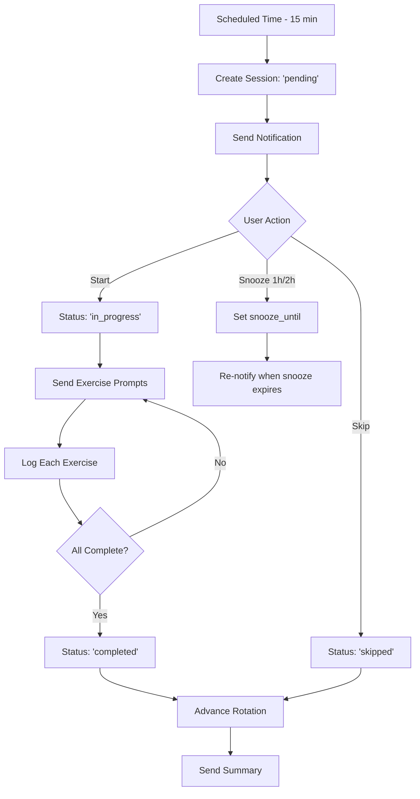

# Workout Tracking Feature

Complete workout tracking implementation for the Medication Tracker Bot. Track scheduled workouts, log exercise completion, and monitor your fitness progress through Telegram.

## 🎯 Features

### Core Functionality
- ✅ **Hierarchical Workout Structure**: Groups → Variants → Exercises
- ✅ **Rotating Schedules**: Automatic A/B/C/D rotation (e.g., PPL, PHUL splits)
- ✅ **Non-Rotating Schedules**: Daily or weekly workouts (e.g., cardio, stretching)
- ✅ **Smart Notifications**: 15-minute advance warning via Telegram
- ✅ **Snooze Support**: 1-hour or 2-hour snooze options
- ✅ **Exercise-by-Exercise Logging**: Track sets, reps, and weight
- ✅ **Automatic Rotation Advancement**: Progress through workout variants after completion
- ✅ **Streak Tracking**: Monitor consecutive workout completions 🔥
- ✅ **Comprehensive Stats**: Completion rates, session history, and analytics

### User Interfaces
- **Telegram Bot**: Interactive notifications with inline buttons
- **REST API**: 18 endpoints for programmatic access


## 📁 Architecture

### Database Schema (7 Tables)
Located in: `internal/store/migrations/012_add_workout_tracking.sql`

```
workout_groups              # Parent workout definitions
├── workout_variants        # Variations (Day A, Day B, Default)
│   └── workout_exercises   # Individual exercises
├── workout_rotation_state  # Current rotation position
├── workout_sessions        # Workout instances
│   └── workout_exercise_logs  # Exercise completion logs
└── workout_schedule_snapshots  # Schedule history
```

### Code Structure

```
internal/
├── store/
│   └── workout.go                    # 40+ store methods (CRUD for all entities)
├── scheduler/
│   └── workout.go                    # Notification scheduling & rotation logic
├── bot/
│   ├── workout.go                    # Notification methods
│   ├── workout_callbacks.go          # Interactive button handlers
│   └── workout_commands.go           # /startnext, /workoutstatus, /workouthistory
└── server/
    └── workout_handlers.go           # 18 REST API endpoints
```

## 🚀 Quick Start

### 1. Insert Seed Data

Edit `workout_seed.sql` and replace `USER_ID_HERE` with your Telegram user ID:

```bash
sqlite3 data/tracker.db < workout_seed.sql
```

**Default seed data includes:**
- **Morning Workouts** (Mon-Sat @ 09:00): Kettlebell Swings 3×15-20 @ 30kg
- **Evening Main** (Mon/Wed/Fri/Sun @ 18:00): Rotating A/B/C/D
  - Day A: Barbell Rows 4×8-10 @ 40kg
  - Day B: Bench Press 4×8-10 @ 40kg
  - Day C: Deadlift 4×8-10 @ 45kg
  - Day D: Overhead Press 4×6-8 @ 30kg

### 2. Run the Bot

The scheduler automatically checks every minute. Workouts will trigger 15 minutes before scheduled time.

```bash
go run cmd/server/main.go
```

### 3. Use Telegram Commands

```
/workoutstatus    # View today's workout status
/startnext        # Manually start next pending workout
/workouthistory   # View recent workouts and streak
```

## 🔔 Notification Flow



## 💬 Telegram Interactions

### Pre-Workout Notification
```
🏋️ Workout starting in 15 minutes

Evening Main - Day A

Exercises:
1. Barbell Rows: 4 × 8-10 @ 40kg

[▶️ Start Now] [⏰ Snooze 1h] [⏰ Snooze 2h] [⏭ Skip]
```

### During Workout (Per Exercise)
```
1. Barbell Rows
4 sets × 8-10 reps @ 40kg

[✅ Done] [✏️ Edit] [⏭ Skip Exercise]
```

### Completion
```
✅ Workout Complete!

Completed 1/1 exercises
```

## 🌐 REST API

All endpoints require authentication via bot token middleware.

### Group Management
- `GET /api/workout/groups` - List all active groups
- `POST /api/workout/groups/create` - Create new group
- `PUT /api/workout/groups/update?id=X` - Update group settings

### Variants & Exercises
- `GET /api/workout/variants?group_id=X` - List variants
- `POST /api/workout/variants/create` - Add variant
- `GET /api/workout/exercises?variant_id=X` - List exercises
- `POST /api/workout/exercises/create` - Add exercise
- `PUT /api/workout/exercises/update?id=X` - Update exercise

### Sessions & History
- `GET /api/workout/sessions?limit=30` - Get history (enriched)
- `GET /api/workout/sessions/details?id=X` - Get session with logs
- `GET /api/workout/stats` - Get 30-day statistics

### Rotation
- `GET /api/workout/rotation/state?group_id=X` - Get current position
- `POST /api/workout/rotation/initialize` - Initialize rotation

See [workout-api-demo.html](../web/static/workout-api-demo.html) for interactive examples.

## 📊 Example: Creating a Workout Group

### Non-Rotating (Daily Cardio)
```json
POST /api/workout/groups/create
{
  "name": "Morning Cardio",
  "description": "Daily running",
  "is_rotating": false,
  "days_of_week": "[1,2,3,4,5,6,0]",
  "scheduled_time": "06:00",
  "notification_advance_minutes": 10
}
```

Then add a variant:
```json
POST /api/workout/variants/create
{
  "group_id": 3,
  "name": "Default",
  "rotation_order": null
}
```

And exercises:
```json
POST /api/workout/exercises/create
{
  "variant_id": 6,
  "exercise_name": "Running",
  "target_sets": 1,
  "target_reps_min": 30,
  "target_reps_max": 30,
  "target_weight_kg": null,
  "order_index": 0
}
```

### Rotating (Push/Pull/Legs)
```json
POST /api/workout/groups/create
{
  "name": "PPL Split",
  "description": "3-day rotating split",
  "is_rotating": true,
  "days_of_week": "[1,3,5]",
  "scheduled_time": "17:00",
  "notification_advance_minutes": 15
}
```

Then create 3 variants with `rotation_order` 0, 1, 2 for Push, Pull, Legs.

Initialize rotation:
```json
POST /api/workout/rotation/initialize
{
  "group_id": 4,
  "starting_variant_id": 7
}
```

## 🔄 Rotation Logic

The scheduler automatically handles rotation:

1. **On Create Session**: Uses `workout_rotation_state.current_variant_id`
2. **On Complete/Skip**: Calls `store.AdvanceRotation()`
   - Finds current variant in ordered list
   - Advances to next variant (circular: D → A)
   - Updates `current_variant_id` and `last_session_date`

Example sequence for 4-day rotation:
```
Session 1: Day A (variant_id=2) → Complete → Advance
Session 2: Day B (variant_id=3) → Complete → Advance
Session 3: Day C (variant_id=4) → Skip → Advance
Session 4: Day D (variant_id=5) → Complete → Advance
Session 5: Day A (variant_id=2) → ...
```

## 📈 Statistics & Tracking

### Workout Stats
```json
GET /api/workout/stats

{
  "total_sessions": 42,
  "completed_sessions": 35,
  "skipped_sessions": 7,
  "completion_rate": 83.33,
  "current_streak": 5
}
```

### Session History
```json
GET /api/workout/sessions?limit=10

[
  {
    "session": {
      "id": 42,
      "status": "completed",
      "scheduled_date": "2026-01-24",
      ...
    },
    "group_name": "Evening Main",
    "variant_name": "Day A",
    "exercises_count": 1,
    "exercises_completed": 1
  },
  ...
]
```

## 🛠️ Customization

### Schedule Format
Days of week stored as JSON array: `[0,1,2,3,4,5,6]` where 0=Sunday
- Mon-Fri: `[1,2,3,4,5]`
- Weekend: `[0,6]`
- Mon/Wed/Fri: `[1,3,5]`

### Notification Timing
Configurable per group via `notification_advance_minutes` (default: 15)

### Snooze Durations
Hardcoded in bot callbacks (1h, 2h). Modify `workout_callbacks.go` to change.

### Rotation Advancement
Automatically happens on `completed` or `skipped` status.
Skip advancement by not calling `store.AdvanceRotation()` in callbacks.

## 🧪 Testing

### Manual Test Flow
1. Insert seed data with your user ID
2. Wait for notification (or use `/startnext`)
3. Click "Start Now"
4. Verify exercise prompts appear
5. Click "Done" on each exercise
6. Check rotation advanced: `/workoutstatus` should show next variant

### API Test
```bash
# Assuming bot running on localhost:8080
curl -H "Authorization: Bearer YOUR_BOT_TOKEN" \
  http://localhost:8080/api/workout/groups
```

View interactive API demo at: `http://localhost:8080/static/workout-api-demo.html`

## 🐛 Troubleshooting

**Notifications not sending?**
- Check `workout_rotation_state` exists for rotating groups
- Verify `days_of_week` JSON is valid
- Ensure `scheduled_time` is in "HH:MM" format
- Check scheduler logs for errors

**Rotation not advancing?**
- Verify `is_rotating=true` for the group
- Check `rotation_order` is set on variants (0, 1, 2, ...)
- Ensure `workout_rotation_state` table has entry for group

**Exercise prompts not appearing?**
- Check variant has exercises in `workout_exercises` table
- Verify `order_index` is set correctly

## 📝 Future Enhancements

**Not yet implemented (optional):**
- [ ] Web UI for workout planner
- [ ] Progressive overload tracking
- [ ] Rest timer between sets
- [ ] Custom exercise database
- [ ] Workout notes/journal
- [ ] Calendar view of scheduled workouts
- [ ] Export workout history to CSV
- [ ] Exercise form videos/links

## 📄 License

Part of the Medication Tracker Bot project.

---

**Built with:** Go, SQLite, Telegram Bot API  
**Total Implementation:** ~2000 lines of code  
**Build Status:** ✅ Production ready
