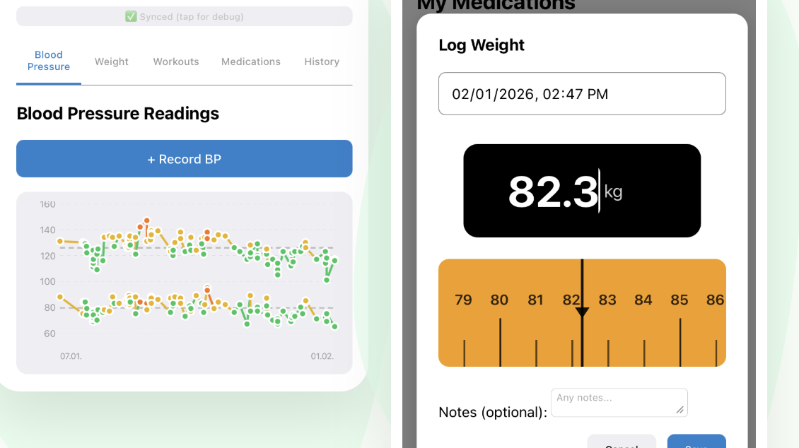
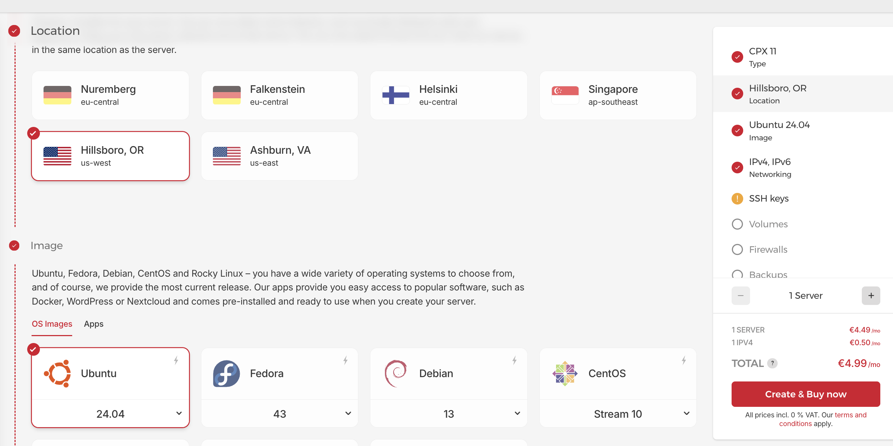

# 🚀 Step-by-Step Installation Guide

<div align="center">
  
  <p><em>Deploy your own secure, private Medication Tracker in minutes.</em></p>
</div>

---

## 👋 Introduction

Welcome! This guide will walk you through setting up your own **Medication Tracker Bot**. 

The installer automates the complex parts (Docker, SSL certificates, Nginx/Traefik configuration), asking you simple questions to customize your setup. By the end, you will have a fully functional web app and Telegram bot running on your own server.

### Why a Separate Server?
We strongly advise using a **dedicated server (VPS)** rather than a shared hosting environment. 

*   **Privacy**: This is your medical data. Hosting it on your own private server ensures that **no one else**—including us—has access to it. It stays 100% yours.
*   **Security**: Securing a dedicated isolated environment is simpler and more robust than shared hosting.
*   **Simplicity**: Our "Simpler is Better" philosophy means you don't need complex cloud infrastructures. Any provider works (Digital Ocean, AWS, Google Cloud, etc.), but a simple VPS is best.

**Network Requirements**:
You only need 2 open ports:
*   `22` for SSH (Secure Shell)
*   `443` (or `8443`) for the Website (HTTPS)
*   *All other ports can be safely blocked by your firewall.*

---

## 🛠 Prerequisites

Before running the installer, ensure you have the following:

### 1. A Linux Server (VPS)
You need a server running **Ubuntu**, **Debian**, **Fedora**, or **CentOS**.
- **Recommended**: Ubuntu 22.04 LTS or 24.04 LTS.
- **Hardware**: Only 1 CPU and 1GB RAM needed (very lightweight).
- **Public IP**: You need a public IPv4 address.
- **Firewall**: Ports `80` (HTTP) and `443` (HTTPS) must be open.

> **Tip for Hetzner Users:**
> Create a **CX22** instance with **Ubuntu 24.04**. Add your SSH key. That's it!
>
> 

### 2. A Domain Name
You need a domain (e.g., `yourname-meds.com` or `meds.yourdomain.com`).
- You will need to point DNS records (A Records) to your server's IP.

### 3. Telegram Bot Token
You need a Telegram Bot to send you reminders.
1. Open **[@BotFather](https://t.me/BotFather)** in Telegram.
2. Send `/newbot`.
3. Name your bot (e.g., "My Med Tracker").
4. Choose a username (e.g., `my_meds_bot`).
5. **Copy the API Token** (it looks like `123456:ABC-DEF1234ghIkl-zyx57W2v1u123ew11`).

### 4. Your Telegram User ID
This ensures **only YOU** can access your data.
1. Open **[@userinfobot](https://t.me/userinfobot)** or **[@myidbot](https://t.me/myidbot)**.
2. Copy your numeric ID (e.g., `123456789`).

---

## 📥 Installation

### Step 1: Connect to Your Server
SSH into your server. Windows users can use **PuTTY** or **PowerShell**; Mac/Linux users use **Terminal**.

```bash
ssh root@<your-server-ip>
```

### Step 2: Download & Run Installer
Run this single command to start the interactive wizard:

```bash
curl -fsSL https://raw.githubusercontent.com/korjavin/medicationtrackerbot/main/install.sh | bash
```


---

## 🧙 The Interactive Walkthrough

The installer will ask you a series of questions. Here is what they mean and how to answer them.

### 1. Install Directory
> "Install directory [/opt/medtracker]:"

- **What it is**: Where all your data, configuration, and database files will live.
- **Recommendation**: Press **Enter** to use the default (`/opt/medtracker`).

### 2. Primary Domain
> "Primary domain for web app (e.g., meds.example.com):"

- **What it is**: The address you will type in your browser to access the dashboard.
- **Action**: Enter your domain (e.g., `meds.mysite.com`).


### 3. HTTPS & Traefik
> "Use bundled Traefik + Let's Encrypt (recommended)? [Y/n]"

- **What it is**: Traefik handles secure HTTPS connections automatically.
- **Recommendation**: **Yes**. Unless you are an expert running your own reverse proxy, let the installer handle this.
- **Email**: Enter your email to receive SSL expiry alerts (rare).

### 4. Timezone
> "Timezone [UTC]:"

- **What it is**: Critical for correct medication reminders!
- **Action**: Enter your timezone (e.g., `America/New_York` or `Europe/Berlin`). The installer tries to guess it.

### 5. Telegram Configuration
> "Telegram Bot Token:"
> "Your Telegram User ID:"

- **Action**: Paste the Token and ID you got in the Prerequisites section.
- **Security**: The ID acts as an allowlist. The bot will ignore everyone else.


### 6. Browser Login (Optional)
> "Enable browser login (OIDC)? [y/N]"

- **What it is**: Allows you to log in via a browser (Chrome, Safari) to manage meds without Telegram.
- **Recommendation**: **Yes**. It makes setting up schedules much easier.
- **Pocket-ID**: The installer can set up [Pocket-ID](https://github.com/pocket-id/pocket-id) for you automatically. It's a simple, local login system.
    - If you choose this, you'll need a second domain (e.g., `id.mysite.com`).


### 7. Litestream Backups (Advanced)
> "Enable Litestream backup to Cloudflare R2? [y/N]"

- **What it is**: Real-time streaming backups of your database to the cloud.
- **Why**: If your server dies, you lose nothing.
- **Requirements**: Cloudflare R2 or Amazon S3 credentials.

---

## ✅ Post-Installation

Once the installer finishes, you will see a success message.

### 1. Configure DNS
If you haven't already, go to your Domain Registrar (Namecheap, GoDaddy, Cloudflare) and create **A Records** pointing to your server IP.

| Type | Name | Content |
|------|------|---------|
| A | `meds` | `<your-server-ip>` |
| A | `id` | `<your-server-ip>` (if using Pocket-ID) |

### 2. Configure Telegram Bot
You need to tell Telegram which domain your bot uses for its Web App.

1. Open **[@BotFather](https://t.me/BotFather)**.
2. Send `/setdomain`.
3. Select your bot.
4. Send your domain: `meds.mysite.com` (or whatever you chose).

### 3. Log In!
- Open `https://meds.mysite.com` in your browser.
- Or open your bot in Telegram and tap **Launch**.

---

## ❓ Troubleshooting

**"Client version 1.24 is too old"**
- Your Docker version is outdated. The installer prints instructions to update it. Run those commands and try again.

**"Permission Denied"**
- Make sure you run the installer as `root` (use `sudo su` if needed).

**"502 Bad Gateway"**
- Wait 30-60 seconds. The containers might still be starting up.
- Check logs: `cd /opt/medtracker && docker compose logs -f`.

**Need more help?**
- Check the issues on [GitHub](https://github.com/korjavin/medicationtrackerbot/issues).

---
*Last Updated: 2026-02-08*

