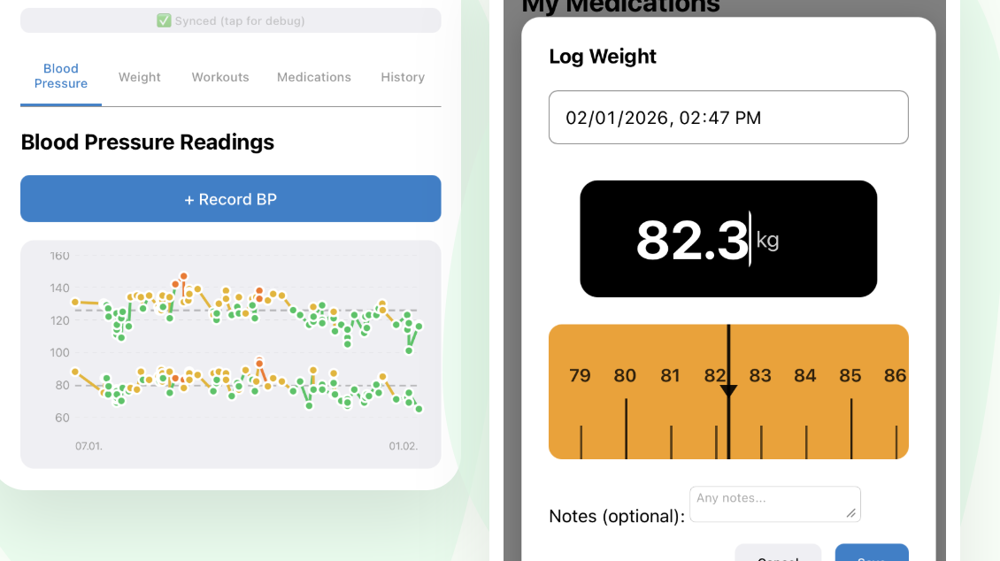
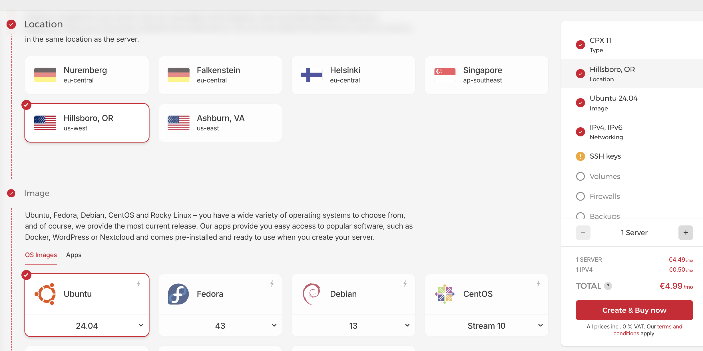
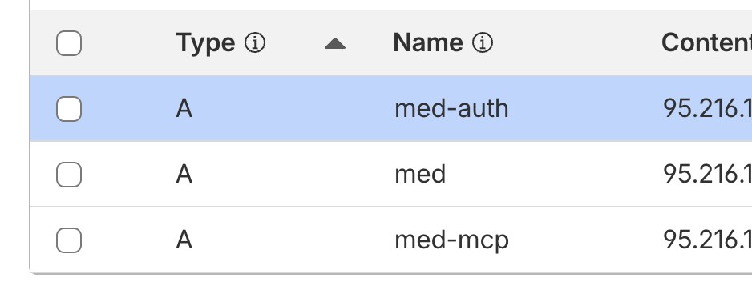
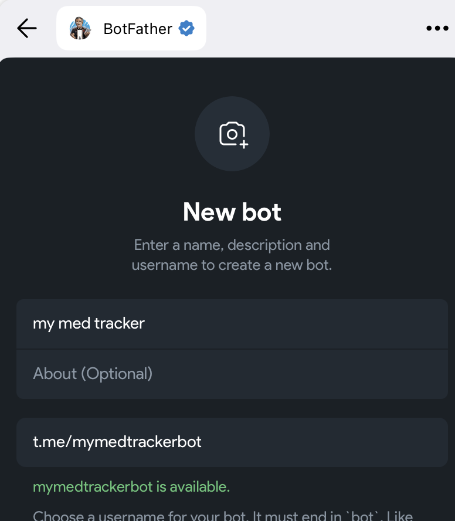
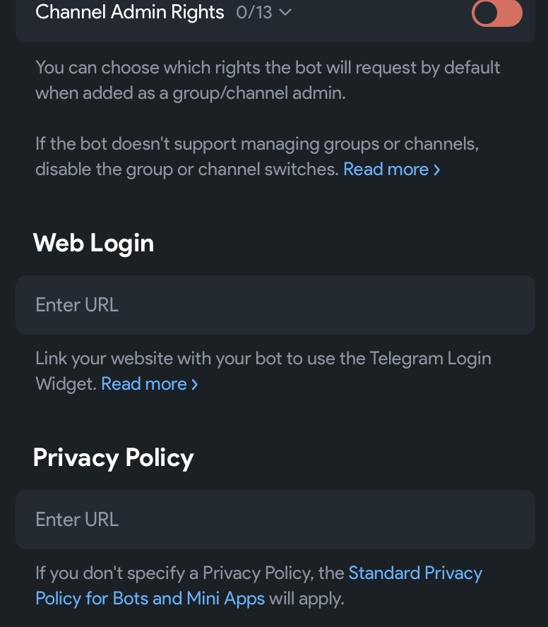
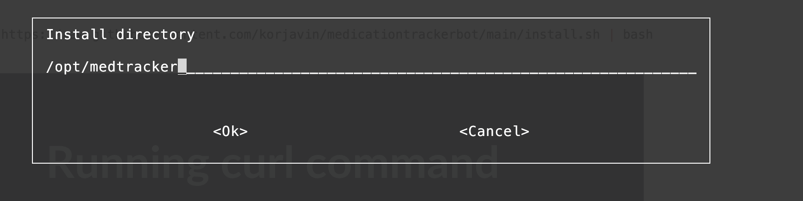
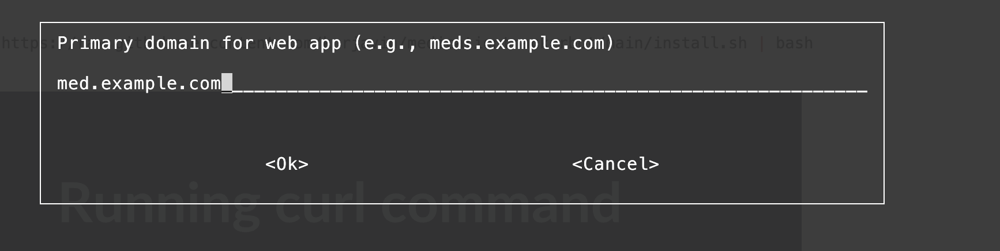

# 🚀 Step-by-Step Installation Guide

<div align="center">
  

  <p><em>Deploy your own secure, private Medication Tracker in minutes.</em></p>
</div>

---

## 👋 Introduction

Welcome! This guide will walk you through setting up your own **Medication Tracker Bot**.

The installer automates the complex parts (Docker, SSL certificates, Nginx/Traefik configuration), asking you simple questions to customize your setup. By the end, you will have a fully functional web app and Telegram bot running on your own server.

### Why a Separate Server?
We strongly advise using a **dedicated server (VPS)** rather than a shared hosting environment.

*   **Privacy**: This is your medical data. Hosting it on your own private server ensures that **no one else**—including us—has access to it. It stays 100% yours.
*   **Security**: Securing a dedicated isolated environment is simpler and more robust than shared hosting.
*   **Simplicity**: Our "Simpler is Better" philosophy means you don't need complex cloud infrastructures. Any provider works (Digital Ocean, AWS, Google Cloud, etc.), but a simple VPS is best.

**Network Requirements**:
You only need 2 open ports:
*   `22` for SSH (Secure Shell)
*   `443` (or `8443`) for the Website (HTTPS)
*   *All other ports can be safely blocked by your firewall.*

---

## 🛠 Prerequisites

Before running the installer, ensure you have the following:

### 1. A Linux Server (VPS)
You need a server running **Ubuntu**, **Debian**, **Fedora**, or **CentOS**.
- **Recommended**: Ubuntu 22.04 LTS or 24.04 LTS.
- **Hardware**: Only 1 CPU and 1GB RAM needed (very lightweight).
- **Public IP**: You need a public IPv4 address.
- **Firewall**: Ports `80` (HTTP) and `443` (HTTPS) must be open.

> **Tip for Hetzner Users:**
> Create a **CX22** instance with **Ubuntu 24.04**. Add your SSH key. That's it!
>
> 

### 2. A Domain Name
You need a domain name to access your tracker securely (HTTPS). Any domain you own works perfectly.

**How to set it up:**
Log in to your domain registrar (Cloudflare, Namecheap, GoDaddy, etc.) and create **A Records** that point to your server's IP address.

> **Why do I need multiple records?**
> As you can see in the screenshot below, I created three records. Here is why:
>
> 1.  **`meds`** (Checking your main site): This is the main web interface for the tracker.
> 2.  **`id`** (Optional): Used for **Pocket-ID**, an open-source authentication server. This allows you to log in securely with Passkeys instead of just Telegram.
> 3.  **`mcp`** (Optional): Required if you want to connect **Claude via MCP**. We use the auth server (`id`) to strictly control access to your data, ensuring only *you* and *your AI* can see it.



### 3. Telegram Bot Token
Currently, the Telegram Bot is the core of the system. While we plan to make the web app fully standalone in the future, right now the bot is essential for:
*   **Notifications**: Receiving timely reminders.
*   **Quick Logging**: Recording meds with a single tap.
*   **File Imports**: Sending files (like **Mi Band** exports) to the tracker for processing.

**Steps:**
1.  Open **[@BotFather](https://t.me/BotFather)**.
2.  Send `/newbot` and follow the prompts to get your token.
    
3.  **Important**: You must link your domain to the bot to allow logging in to the website via Telegram.
    *   Send `/mybots` to BotFather.
    *   Select your bot.
    *   Tap **Bot Settings**.
    *   Tap **Domain**.
    *   Enter your domain (e.g., `meds.example.com`).
    

### 4. Your Telegram User ID
This is a critical security feature. We implement a strict **Allowlist**.

*   **How it works**: The bot checks every message against this ID.
*   **Security**: If anyone else tries to message your bot, they will be ignored. The bot **only** responds to you.
*   **Get your ID**: Open **[@userinfobot](https://t.me/userinfobot)** and copy the numeric ID.

---

## 📥 Installation

### Step 1: Connect to Your Server
SSH into your server. Windows users can use **PuTTY** or **PowerShell**; Mac/Linux users use **Terminal**.

```bash
ssh root@<your-server-ip>
```

### Step 2: Download & Run Installer
Run this single command to start the interactive wizard:

```bash
curl -fsSL https://raw.githubusercontent.com/korjavin/medicationtrackerbot/master/install.sh | bash
```



---

## 🧙 The Interactive Walkthrough

The installer will ask you a series of questions. **We generally recommend accepting the default values (just press Enter)** unless you have a specific reason to change them.

### 1. Install Directory
> "Install directory [/opt/medtracker]:"

- **Recommended**: Press **Enter** to use the default (`/opt/medtracker`).

### 2. Primary Domain
> "Primary domain for web app (e.g., meds.example.com):"

- **Action**: Enter your domain (e.g., `meds.mysite.com`).



### 3. HTTPS & Traefik
> "Use bundled Traefik + Let's Encrypt (recommended)? [Y/n]"

- **Recommended**: **Yes**. It handles SSL certificates automatically.

### 4. Timezone
> "Timezone [UTC]:"

- **Action**: Enter your timezone (e.g., `America/New_York`) for accurate reminders.

### 5. Telegram Configuration
> "Telegram Bot Token:"
> "Your Telegram User ID:"

- **Action**: Paste the Token and ID you got in the Prerequisites section.

### 6. Let's Encrypt Email
> "Email for Let's Encrypt [admin@example.com]:"

- **Action**: Enter a real email — it receives certificate-expiry warnings from Let's Encrypt.
- Only asked when bundled Traefik is enabled.

### 7. Browser Login + MCP (Pocket-ID)
> "Use Pocket-ID for browser login and MCP (recommended)? [Y/n]"

- **Recommendation**: **Yes** (default). The installer pulls and configures [Pocket-ID](https://github.com/pocket-id/pocket-id) automatically and points OIDC + the MCP server at it.
- You'll then be asked for the Pocket-ID domain (e.g., `id.example.com`) and whether you already have OIDC client credentials. If not, the installer skips them now and you complete the setup in the Post-Installation steps below.

### 8. Web Push (Optional)
> "Enable web push (browser notifications)? [Y/n]"

- **Recommendation**: **Yes** (default). Lets the PWA fire reminders even when the page is closed.
- The installer offers to **auto-generate VAPID keys** — accept unless you already have a pair.

### 9. AI Food & Activity Logging (Optional)
> "Enable AI food/activity logging? [y/N]"

- **What it is**: Lets `/food` and `/activity` parse natural-language entries via an OpenAI-compatible API.
- If you say yes, you'll be asked for an API key, base URL (default `https://api.openai.com/v1`) and model (default `gpt-4o-mini`).
- You can also point it at any OpenAI-compatible endpoint (Ollama, vLLM, OpenRouter…).

### 10. External Workout Webhook (Optional)
> "Enable external workout webhook (Mi Notify)? [y/N]"

- **What it is**: Lets external sources (e.g. the Mi Notify Android app) push completed workouts to the bot via a shared API key.
- The installer offers to auto-generate the key. Save the printed value — you'll need it on the sender side.

### 11. Claude MCP Connector (Optional)
> "Enable Claude MCP connector (optional)? [y/N]"

- Only shown if you didn't already enable Pocket-ID in step 7 (otherwise MCP is wired up automatically).
- Asks for the MCP domain (e.g., `mcp.example.com`) and Pocket-ID client credentials.

### 12. Litestream Backups (Optional)
> "Enable Litestream backup to Cloudflare R2 (optional)? [y/N]"

- **What it is**: Real-time streaming backups to any S3-compatible storage (R2, S3, Wasabi, B2, MinIO).
- **Why**: Keeps your data safe if the server fails.
- ⚠️ Backups contain sensitive health data. Use a private bucket with restricted keys.

---

## ✅ Post-Installation

Once the installer finishes, you will see a success message.

### 1. Configure DNS
If you haven't already, go to your Domain Registrar (Namecheap, GoDaddy, Cloudflare) and create **A Records** pointing to your server IP.

| Type | Name | Content |
|------|------|---------|
| A | `meds` | `<your-server-ip>` |
| A | `id` | `<your-server-ip>` (if using Pocket-ID) |
| A | `mcp` | `<your-server-ip>` (if using the Claude MCP connector) |

### 2. Configure Telegram Bot
You need to tell Telegram which domain your bot uses for its Web App.

1. Open **[@BotFather](https://t.me/BotFather)**.
2. Send `/mybots` and select your bot.
3. Tap **Bot Settings** → **Domain**.
4. Enter your domain: `meds.mysite.com` (or whatever you chose).

### 3. Log In!
- Open `https://meds.mysite.com` in your browser.
- Or open your bot in Telegram and tap **Launch**.

### 4. Configure Pocket-ID (If Installed)
If you chose to install **Pocket-ID**, you need to complete its setup to enable web login and the AI Connector.

#### Step 1: First-Time Admin Setup
1.  Open `https://id.mysite.com/setup` in your browser.
2.  Create your **Admin account** — this is your main identity.
3.  You will be prompted to register a **Passkey** (fingerprint / Face ID / hardware key).

#### Step 2: Get Your One-Time Login Code
> **Why?** Pocket-ID uses Passkeys only — there is no password. Before you can log in from a new browser or device, you need to generate a **one-time code** on the server.

Run this command on your server (replace `id.mysite.com` with your Pocket-ID domain):

```bash
cd /opt/medtracker
docker compose exec pocket-id ./pocket-id one-time-access-token --email admin@example.com
```

This prints a **one-time URL** like:
```
https://id.mysite.com/one-time-access?token=XXXXXXXXXXXXXXXX
```

Open that URL in your browser. It will log you in and allow you to **register your Passkey** for future logins.

#### Step 3: Create an OIDC Client
1.  Log in to `https://id.mysite.com`.
2.  Go to **OIDC Clients** → **Create Client**.
3.  Set the **Redirect URI** to: `https://meds.mysite.com/auth/oidc/callback`
4.  Copy the generated **Client ID** and **Client Secret**.
5.  Update `/opt/medtracker/.env`:
    ```
    OIDC_CLIENT_ID=<paste client id>
    OIDC_CLIENT_SECRET=<paste client secret>
    OIDC_ADMIN_EMAIL=<your email>
    OIDC_ALLOWED_SUBJECT=<your Pocket-ID user subject (sub UUID)>
    ```
    > Get the subject from your Pocket-ID user profile page (the **Subject** / `sub` field). At least one of `OIDC_ADMIN_EMAIL` or `OIDC_ALLOWED_SUBJECT` is required for the bot to accept logins.
6.  Restart the stack: `docker compose up -d`

*(Screenshots coming soon)*

---

## ❓ Troubleshooting

**"Client version 1.24 is too old"**
- Your Docker version is outdated. The installer prints instructions to update it. Run those commands and try again.

**"Permission Denied"**
- Make sure you run the installer as `root` (use `sudo su` if needed).

**"502 Bad Gateway"**
- Wait 30-60 seconds. The containers might still be starting up.
- Check logs: `cd /opt/medtracker && docker compose logs -f`.

**Need more help?**
- Check the issues on [GitHub](https://github.com/korjavin/medicationtrackerbot/issues).

---
*Last Updated: 2026-04-25*
